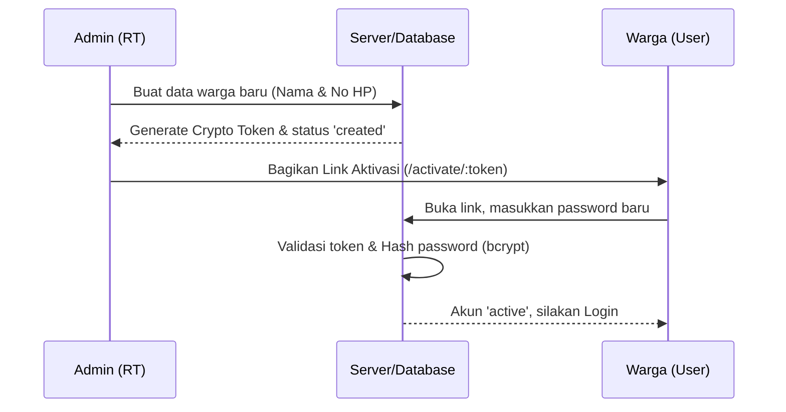
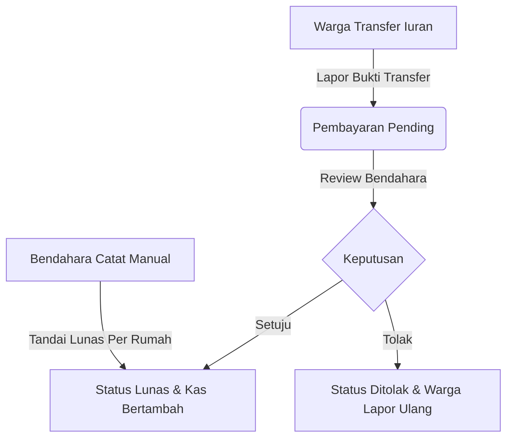
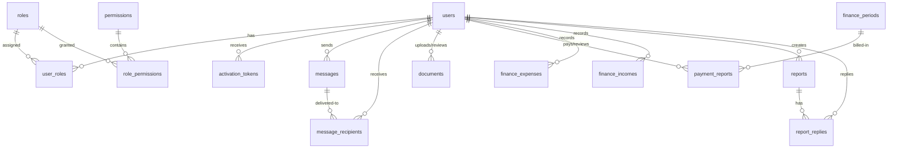

# 👥 RT Management System (RT 04 / RW 18) - Detail Fitur Aplikasi

Sistem Pengelolaan Rukun Tetangga (RT 04 / RW 18) adalah platform digital modern berbasis web yang dirancang khusus untuk mengelola administrasi komunitas warga secara terstruktur, transparan, aman, dan efisien. Aplikasi ini memisahkan area publik (Landing & Login), area Warga (Portal Warga), dan area Pengurus (Admin Panel) dengan menerapkan sistem keamanan terenkripsi dan pembatasan akses ketat.

---

## 🧱 Teknologi Utama & Arsitektur Sistem

Aplikasi dibangun menggunakan teknologi solid dengan arsitektur berlapis (*Layered Architecture*) untuk menjamin pemisahan fungsionalitas (*Separation of Concerns*) dan kemudahan pemeliharaan kode:

*   **Runtime Environment:** Node.js (Express.js)
*   **View Engine:** EJS (Server-side rendering dengan tata letak visual premium & responsif)
*   **Database:** PostgreSQL (Sebagai database relasional utama)
*   **ORM:** Prisma (Untuk query database yang aman, konsisten, dan transaksional)
*   **Manajemen Sesi:** `express-session` & `connect-pg-simple` (Sesi disimpan persisten di dalam PostgreSQL)
*   **Autentikasi & Keamanan:**
    *   `bcrypt` (Hashing password 10 salt rounds)
    *   `zod` (Validasi tipe data masukan secara ketat di backend)
    *   `csurf` (Proteksi serangan Cross-Site Request Forgery di semua form input)
    *   `express-rate-limit` (Pembatasan laju request pada login guna mencegah brute force)
    *   `multer` (Unggah berkas bukti transaksi dan media laporan warga secara aman)
    *   `winston` & `morgan` (Sistem pencatatan log aktivitas dan lalu lintas HTTP)
*   **Styling (Desain Visual):** Vanilla CSS dengan sistem variabel warna terpusat yang modern (Sesuai `THEME.md` untuk kenyamanan visual, efek transisi halus, mode grid responsif, dan layout Sidebar Admin tetap).

---

## 🗺️ Peta Akses & Rute Aplikasi

```text
/                       → Landing Page (Halaman Utama Publik)
/auth/login             → Form Login (Dilengkapi Rate Limit)
/auth/logout            → Keluar Sistem (Session Destroy)
/activate/:token        → Aktivasi Akun & Set Password (Sekali pakai)

/portal                 → Dashboard Portal Warga (Default setelah login)
/portal/messages        → Inbox Pesan Pribadi & Broadcast Warga
/portal/finance         → Portal Iuran Warga (Riwayat & Lapor Transfer)
/portal/documents       → Manajemen Pengunggahan Dokumen Warga
/portal/reports         → Forum Lapor RT & Diskusi Publik

/admin                  → Dashboard Panel Admin (Memerlukan dashboard.view)
/admin/users            → CRUD Warga & Bulk Import CSV (Memerlukan warga.read/create)
/admin/roles            → Konfigurasi Perizinan & Role (Memerlukan role.manage)
/admin/messages         → Komposisi Pesan Admin (Memerlukan message.create)
/admin/finance          → Dashboard Keuangan RT (Memerlukan finance.manage)
/admin/documents        → Penilaian Berkas Warga (Memerlukan document.manage)
/admin/reports          → Pengawasan Laporan & Status (Memerlukan report.manage)
/admin/settings         → Pengaturan Info Darurat Web (Memerlukan setting.manage)
/admin/error-logs       → Troubleshooting Log Kesalahan (Memerlukan error_log.read)
```

---

## 🎨 Layout & Estetika Visual (Design System)

Aplikasi memiliki identitas visual yang seragam di seluruh halaman untuk menciptakan pengalaman pengguna premium:
1.  **Palet Warna Harmonis:**
    *   **Primary (Utama):** Biru modern `#2563EB` dengan variasi gelap `#1E40AF` dan latar lembut `#DBEAFE`.
    *   **Latar Belakang:** Abu-abu bersih `#F9FAFB` untuk mengurangi kelelahan mata.
    *   **Warna Status:** Sukses (`#16A34A` - Hijau), Peringatan (`#F59E0B` - Jingga), Bahaya (`#DC2626` - Merah).
2.  **Desain Komponen Konsisten:**
    *   **Kartu (Cards):** Berlatar putih (`#FFFFFF`), sudut melengkung modern (Radius `8px`), dengan bayangan tipis (`0 1px 3px rgba(0, 0, 0, 0.08)`) dan border abu-abu halus.
    *   **Form Input:** Sudut melengkung, dengan border abu-abu `#D1D5DB` yang akan memancarkan bayangan biru lembut saat aktif (*focus state*).
    *   **Tombol (Buttons):** Efek hover transisi warna yang mulus (`transition: all 0.2s ease`).
3.  **Layout Sidebar Khusus Admin:** Halaman Admin memiliki navigasi sebelah kiri yang menetap (*fixed sidebar* selebar `260px`) dengan indikator menu aktif (border kiri biru tebal) agar pengurus mudah berpindah antar fitur.

---

## 🚀 Rincian Fitur Utama Aplikasi

Berikut adalah penjelasan mendalam mengenai 10 fitur utama aplikasi beserta alur kerja dan skema teknis yang diterapkan:

### 1. Autentikasi Pengguna & Alur Aktivasi Akun (Secure User Lifecycle)
Sistem tidak menyediakan pendaftaran akun secara mandiri oleh publik guna menjaga validitas data warga. Akun dibuat secara tertutup oleh pengurus.



*   **Protokol Keamanan:**
    *   **Token Aktivasi Kriptografis:** Token dibuat menggunakan `crypto.randomBytes(32)` menghasilkan 64 karakter heksadesimal acak yang disimpan di database dengan masa kedaluwarsa 24 jam.
    *   **Status Akun:** Warga yang baru didaftarkan berstatus `created` (belum bisa login). Setelah membuat password via link token, status berubah secara transaksional menjadi `active`.
    *   **Sesi PostgreSQL SInkron:** Sesi login ditulis langsung menggunakan `req.session.save` sebelum pengalihan halaman (*redirect*). Hal ini menjamin status login warga telah tercatat di PostgreSQL terlebih dahulu guna mencegah kegagalan sesi akibat *race condition*.

---

### 2. Manajemen Warga / Pengguna (Citizen Directory)
Fitur untuk mengelola profil warga secara mendalam. Warga memiliki detail informasi pribadi yang lengkap, mencakup:
*   Informasi Dasar: NIK (16 digit), Nomor Kartu Keluarga, Nama Lengkap, No HP, Tanggal Lahir, Nomor Rumah.
*   Informasi Keluarga: Nama Pasangan, No HP Pasangan, NIK Pasangan, Tanggal Lahir Pasangan, serta data Anak (disimpan dalam format JSON dinamis `[{name, birthDate, nik}]`).

> [!TIP]
> **Fitur Bulk Import Warga via CSV & Layar Review:**
> Pengurus dapat mengunggah ratusan data warga sekaligus dengan mengunggah berkas CSV sesuai template. Keunggulan alur ini:
> 1. Berkas CSV diproses di memori menggunakan parser khusus tanpa dependensi eksternal.
> 2. Data hasil parsing disimpan sementara dalam sesi (`req.session.tempImportData`).
> 3. Admin diarahkan ke halaman **Review Bulk Import** di mana sistem mendeteksi:
>    *   **Warga Baru:** Diberi tanda warna hijau, otomatis dicentang untuk dibuatkan akun dan token aktivasi secara otomatis.
>    *   **Warga Sudah Ada:** Dicocokkan berdasarkan Nomor HP, diberi tanda warna kuning, dan tidak dicentang secara default. Admin dapat memverifikasi perubahan nama/role, lalu mencentang jika ingin menimpa (*overwrite*) data lama tersebut secara aman dalam satu transaksi database tunggal.

---

### 3. Role-Based Access Control (RBAC) Granular
Sistem menerapkan pembatasan hak akses yang sangat ketat berbasis **Permission (Izin)**, bukan berbasis nama Role.

> [!IMPORTANT]
> **Prinsip Utama Keamanan RBAC:**
> Di dalam seluruh kode aplikasi, pemeriksaan hak akses tidak pernah mengecek nama grup peran secara langsung seperti `if (role === 'admin')`. Pemeriksaan WAJIB mengecek izin spesifik, contoh: `if (hasPermission('warga.create'))`. Hal ini memberikan keluwesan luar biasa jika di masa depan pengurus ingin merombak atau menambah peran baru tanpa perlu menulis ulang baris kode program.

*   **Manajemen Peran dinamis (`/admin/roles`):**
    *   Pengurus dengan izin `role.manage` dapat membuat role baru atau menghapusnya.
    *   Admin dapat menambahkan izin (*assign*) atau mencabut izin (*revoke*) dari suatu role secara dinamis dari tabel perbandingan 2-kolom (Assigned vs Unassigned Permissions).
    *   **Proteksi Super Admin:** Sistem mengunci peran `super_admin` agar tidak dapat dihapus, dan memproteksi agar peran tersebut tidak kehilangan seluruh izinnya secara tidak sengaja, menjaga sistem agar tidak terkunci (*system lockout*).

---

### 4. Keuangan RT & Kas Bulanan (RT Finance & Cashflows)
Sistem pembukuan kas warga yang dinamis, transparan, dan mudah digunakan oleh Bendahara.



*   **Pengelompokan Berbasis Nomor Rumah (House-Based Finance):**
    *   Sistem tidak mengelompokkan iuran per kepala keluarga secara terpisah, melainkan **dikelompokkan per nomor rumah**.
    *   Status iuran rumah akan otomatis bertanda **LUNAS** jika salah satu anggota keluarga di rumah tersebut telah melakukan pembayaran pada periode berjalan. Ini mencerminkan budaya riil iuran per rumah di lingkungan RT.
*   **Penandaan Lunas Manual (Manual Payment Marking):** Bendahara dapat menandai lunas nomor rumah yang belum membayar. Sistem otomatis membuat rekaman pembayaran baru dengan metode `"manual"` dan mencantumkan keterangan nama bendahara yang memprosesnya.
*   **Pencatatan Pengeluaran Kas RT (RT Expense):** Bendahara dapat mencatat pengeluaran dana kas RT (Nominal, Kategori seperti Kebersihan/Keamanan, Penerima Dana, Tanggal, dan mengunggah berkas bukti kwitansi/nota secara aman menggunakan `multer` ke folder `/uploads/payments/`).
*   **Pencatatan Pemasukan Lain-lain (RT Other Income):** Mencatat dana masuk di luar iuran wajib warga (misalnya donasi warga luar, sponsorship acara agustusan, dana hibah kelurahan, atau kas mandiri).
*   **Pencarian Fuzzy & Filter Tanggal Live Sisi Klien:** Di halaman kas RT, Bendahara disajikan tabel mutasi kas yang dilengkapi input kueri pencarian teks dan filter rentang tanggal. Sistem memproses penyaringan baris data secara instan di sisi klien (*client-side filtering, zero-latency*) demi pengalaman administrasi yang cepat dan responsif.
*   **Ekspor CSV Kompatibel Microsoft Excel:**
    Laporan keuangan dapat diunduh dalam format berkas CSV. Controller memformat data dengan pembatas titik koma (`;`) dan menyisipkan penanda **UTF-8 BOM (`\uFEFF`)** di awal baris agar huruf tercetak bersih dan nominal tidak rusak saat dibuka di Microsoft Excel komputer pengurus.

---

### 5. Portal Warga (Resident Hub)
Halaman dashboard utama warga setelah masuk ke dalam sistem. Portal dirancang dengan tata letak minimalis dan fungsional:
*   **Hero Welcome Banner:** Gradasi biru premium menampilkan nama warga, nomor rumah, dan tombol akses cepat.
*   **Quick Actions Grid:** 4 tombol navigasi interaktif dengan efek transisi melayang (*hover translateY & shadow effect*):
    1.  📋 *My Profile* (Untuk meninjau detail keluarga & nomor rumah).
    2.  📢 *Messages* (Dilengkapi indikator lencana jumlah pesan belum dibaca).
    3.  📄 *Documents* (Untuk mengunggah berkas penting warga).
    4.  ⚙️ *Settings* (Pengaturan preferensi akun).
*   **Latest Announcements:** Menampilkan daftar pengumuman penting terbaru secara live dari database dengan lencana klasifikasi warna (Acara = Hijau, Pemeliharaan = Jingga, Aturan = Biru).
*   **Emergency Contact Card:** Kotak kontak darurat berlatar belakang merah lembut (`#FEE2E2`) yang memajang nomor telepon penting pengurus RT untuk situasi darurat warga.

---

### 6. Pesan Masuk & Pengumuman (Communication Center)
Saluran komunikasi terarah bagi pengurus untuk menyebarkan informasi kepada warga:
*   **Tipe Pesan (`MessageType`):**
    *   `personal`: Pesan rahasia yang ditujukan khusus ke satu atau beberapa warga terpilih.
    *   `broadcast`: Pesan massal yang dikirim ke seluruh warga aktif di lingkungan RT (otomatis membuat relasi penerima ke seluruh warga).
    *   `announcement`: Pengumuman umum. Tidak masuk ke kotak masuk pribadi, melainkan langsung terpampang di halaman depan Portal Warga.
*   **Read Receipt (Pelacak Status Baca):** Di panel admin, pengurus dapat meninjau detail pesan terkirim dan melihat tabel warga penerima lengkap dengan status waktu kapan warga tersebut membuka pesan (`readAt`). Warga yang memiliki pesan baru akan melihat badge hijau `"NEW"` di inbox mereka.

---

### 7. Lapor RT & Forum Warga (Citizen Reports & Discussion)
Fitur interaktif sebagai wadah bagi warga untuk melaporkan keluhan, kerusakan fasilitas, atau aspirasi di lingkungan RT:
*   **Penyampaian Laporan:** Warga dapat menulis laporan dengan mengunggah lampiran gambar/video bukti kejadian.
*   **Alur Status Laporan (`ReportStatus`):** Status laporan dipantau secara transparan:
    *   `open` (Laporan baru masuk).
    *   `in_progress` (Pengurus RT sedang menindaklanjuti keluhan).
    *   `resolved` (Masalah telah selesai ditangani).
    *   `closed` (Laporan ditutup oleh pengurus).
*   **Forum Balasan Diskusi:** Pengurus dan warga dapat berbalas komentar di bawah laporan tersebut guna mendiskusikan solusi terbaik, layaknya forum komunitas yang demokratis.

---

### 8. Manajemen Dokumen Warga (Document Manager)
Memudahkan warga mengirimkan salinan digital dokumen kependudukan untuk urusan verifikasi surat pengantar atau pendataan penduduk:
*   **Unggah Berkas Mandiri:** Warga dapat mengunggah dokumen dengan kategori `ktp` (Kartu Tanda Penduduk), `kk` (Kartu Keluarga), `surat_keterangan`, atau dokumen `other`.
*   **Penilaian Dokumen oleh Pengurus:** Pengurus meninjau berkas yang dikirimkan, lalu menentukan status verifikasi: `pending`, `approved` (Disetujui), atau `rejected` (Ditolak, lengkap dengan input catatan alasan penolakan bagi warga).

---

### 9. Log Error Sistem (System Audit Trail)
Fitur khusus pengawasan sistem yang hanya dapat diakses oleh peran dengan izin `error_log.read` (seperti `super_admin`). Fitur ini mengumpulkan dan menampilkan daftar kegagalan sistem, pengecualian (*exceptions*), atau kesalahan koneksi database yang tercatat secara internal. Berguna untuk pelacakan kendala secara cepat tanpa perlu membuka akses SSH ke server utama.

---

### 10. Pengaturan Sistem (System Settings)
Mengizinkan pengurus dengan izin `setting.manage` untuk mengubah teks dinamis pada sistem tanpa perlu mengubah kode program. Contohnya adalah mengubah nomor telepon darurat RT, nama ketua RT, alamat kantor sekretariat, atau jam layanan warga yang ditampilkan di Portal Warga.

---

## 📊 Hubungan Relasi Database (Database Schema Relations)

Struktur tabel di dalam PostgreSQL dikelola secara efisien menggunakan Prisma ORM dengan relasi *Cascading* yang aman guna menjaga integritas data:



### Penjelasan Relasi Kunci:
1.  **RBAC Junction Tables (`user_roles` & `role_permissions`):** Menghubungkan secara *many-to-many* antara pengguna dengan perannya, dan peran dengan daftar izin granularnya.
2.  **Activation Tokens (`activation_tokens`):** Memiliki relasi *one-to-many* dari pengguna. Menghapus data pengguna otomatis menghapus seluruh token terkait (*onDelete: Cascade*).
3.  **Message Delivery (`messages` & `message_recipients`):** Pesan tunggal (`Message`) dihubungkan ke tabel penerima (`MessageRecipient`) untuk melacak status baca per individu warga secara mandiri.
4.  **Financial Transactions (`payment_reports`, `finance_expenses`, `finance_incomes`):** Semua pemasukan dan pengeluaran kas melacak aktor pembuat/peninjau (`reviewedBy` / `createdById`) untuk audit keuangan yang transparan.

---

## 🔐 Ringkasan Proteksi Keamanan Aplikasi

Aplikasi dirancang dengan standar keamanan web OWASP (Open Web Application Security Project) di setiap fiturnya:

> [!CAUTION]
> **Lapisan Keamanan Berlapis:**
> *   **Validasi Masukan (Zod):** Semua parameter HTTP body (seperti form iuran dan login) divalidasi menggunakan Zod Schema sebelum diproses oleh Service. Ini memblokir serangan manipulasi data kotor dari luar.
>   *   **CSRF Protection (csurf):** Setiap form input di dalam aplikasi EJS memuat token CSRF tersembunyi (`_csrf`). Request POST tanpa token valid akan langsung diblokir oleh Express middleware guna mencegah serangan eksekusi form ilegal dari situs lain.
>   *   **Hashing Sandi (Bcrypt):** Kata sandi disimpan dalam bentuk hash tidak dapat diuraikan kembali (*one-way hash*) menggunakan salt rounds tingkat tinggi.
>   *   **Rate Limiter:** Percobaan login yang berulang dalam jangka waktu singkat pada satu alamat IP akan ditangguhkan untuk mencegah serangan tebakan kamus kata sandi (*dictionary / brute-force attack*).
